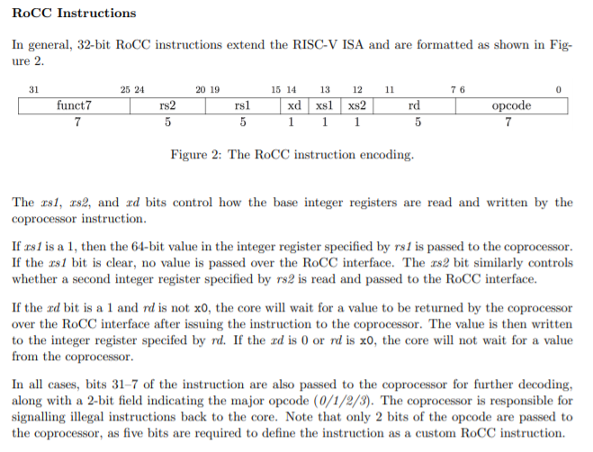
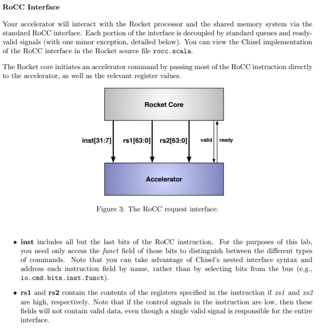
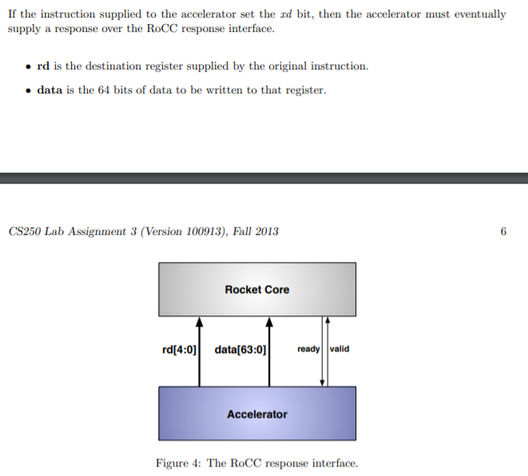

# ROCC_based_neurosynapse


<details><summary><tt> Instructions to run simulations </tt></summary>
<p>

#### Run 1st operation design + TB
```
cd run_scripts
chmod +x run_operation1.sh
./run_operation1.sh
```


```diff
- o/p log "log_operation1.txt" will be created inside "log" directory
- operation1 does "result = a*b+c*d", where result,a,b,c,d are all 32 bit IEEE floating pt. numbers
```

#### Run 2nd operation design + TB
```
cd run_scripts
chmod +x run_operation2.sh
./run_operation2.sh


```


```diff
- o/p log "log_operation2.txt" will be created inside "log" directory
- operation2 does "result = a/b+c/d", where result,a,b,c,d are all 32 bit IEEE floating pt. numbers
```

#### Run 3rd operation design + TB
```
cd run_scripts
chmod +x run_operation3.sh
./run_operation3.sh
```


```diff
- o/p log "log_operation3.txt" will be created inside "log" directory
```


</p>
</details>


#### ROCC Instruction format


```md
So we will have the signal inst[31:0] going to the ROCC accelerator

inst[31:25] = funct7
inst[24:20] = rs2
inst[19:15] = rs1
inst[14] = xd
inst[13] = xs1
inst[12] = xs2
inst[11:7] = rd
inst[6:5] = opcode 

According to format above


opcode = 0 (For Neurosynapse accelerator, only 2 bits are sent)
xd = 0 (ROCC core will expect nothing in return, all return values will be stored in local physical register file)
xs1 = 1 (ROCC core will provide rs1)
xs2 = 1 (ROCC core will provide rs2)
rs1 = 5'b00000 (fixed register address from which all rs1 operands will come)
rs2 = 5'b00001 (fixed register address from which all rs2 operands will come)
rd = (destination register address of local reg file taken as it is) - 5 bits so 32 addresses possible
funct7 = operation1/operation2/operation3
         operation1 = 7'b0000_001
         operation2 = 7'b0000_010
         operation3 = 7'b0000_011

```

#### ROCC Request Interface


```md
Supply the following from ROCC_core (TB in our case)
inst[31:0] = ROCC_instruction
rs1[63:0]
- rs1[63:32] = 1st_operand
- rs2[31:0] = 2nd_operand
rs2[63:0]
- rs2[63:32] = 3rd_operand
- rs2[31:0] = 4th_operand  

valid should be held high while giving instruction and held stable until ready (coming from ROCC_accel)
is high.

When (valid && ready === 1), complete request will be accepted and ready will be made low until ROCC_accel completes 
processing present instruction and goes for next one
```

#### ROCC Response Interface



```md
Nothing to supply back to the core, write 
the result [31:0] value to register address specified by rd=inst[11:7]
```
```md
Then how to get the value written to local register file if there is no reg_read stage or spec does not allow it?

Approach will be -
Get it from TB the register value written to by previous operation. 
-> Store previous "rd" from previous sent inst[31:5]
-> Tap Register_File[rd] of DUT in TB when operation of rocc_accel completes
-> Send this value along with others in next inst[31:5] 
```